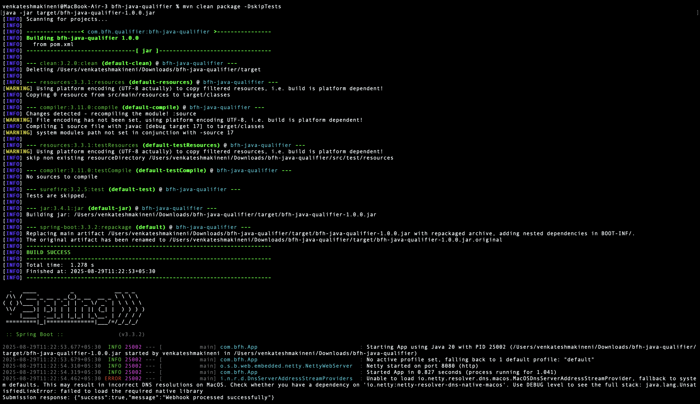

# BFH Java Qualifier - SQL Submission

This project is my solution for the **Bajaj Finserv Health Java Qualifier**.

## How it works
- On startup, the app calls the `generateWebhook/JAVA` API to get a `webhook` and `accessToken`.
- It then submits the **assigned SQL query** to the webhook using the token in the `Authorization` header.
- Prints the response in the console.

## Final SQL Query
```sql
SELECT 
  p.AMOUNT AS SALARY,
  CONCAT(e.FIRST_NAME, ' ', e.LAST_NAME) AS NAME,
  TIMESTAMPDIFF(YEAR, e.DOB, CURDATE()) AS AGE,
  d.DEPARTMENT_NAME
FROM PAYMENTS p
JOIN EMPLOYEE e   ON e.EMP_ID = p.EMP_ID
JOIN DEPARTMENT d ON d.DEPARTMENT_ID = e.DEPARTMENT
WHERE DAY(p.PAYMENT_TIME) <> 1
ORDER BY p.AMOUNT DESC, p.PAYMENT_TIME DESC
LIMIT 1;
```

## 📸 Sample Output

Here is the actual console output after running the app:


